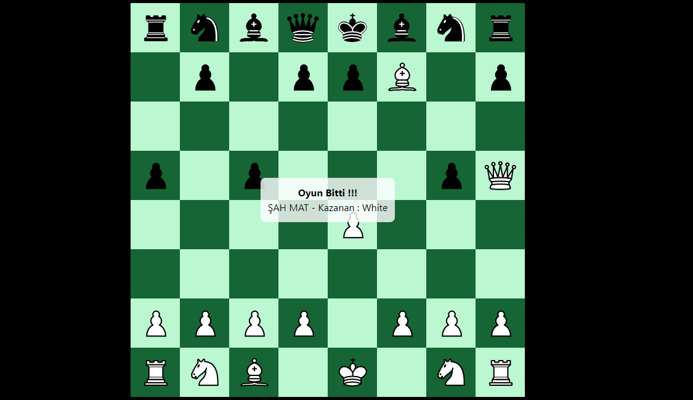

## React Chess

Bu uygulamada React ile Satranç oyunu kodlandı

### Kullanılan Teknolojiler(Dependencies)

#### `chess.js`

chess.js, satranç hamlesi oluşturma/doğrulama, taş yerleştirme/hareket ve kontrol/şah mat/çıkmaz tespiti için kullanılan bir TypeScript satranç kitaplığıdır

#### `react-dnd`

React DnD, bileşenlerinizi ayrı tutarken karmaşık sürükle ve bırak arabirimleri oluşturmanıza yardımcı olan bir dizi React yardımcı programıdır.

#### `rxjs`

React-RxJS, uygulamanızın durumunun dinamik davranışını tanımlandığı andaki tamamen ifade etmenize olanak tanır.

### Screenshot

.

